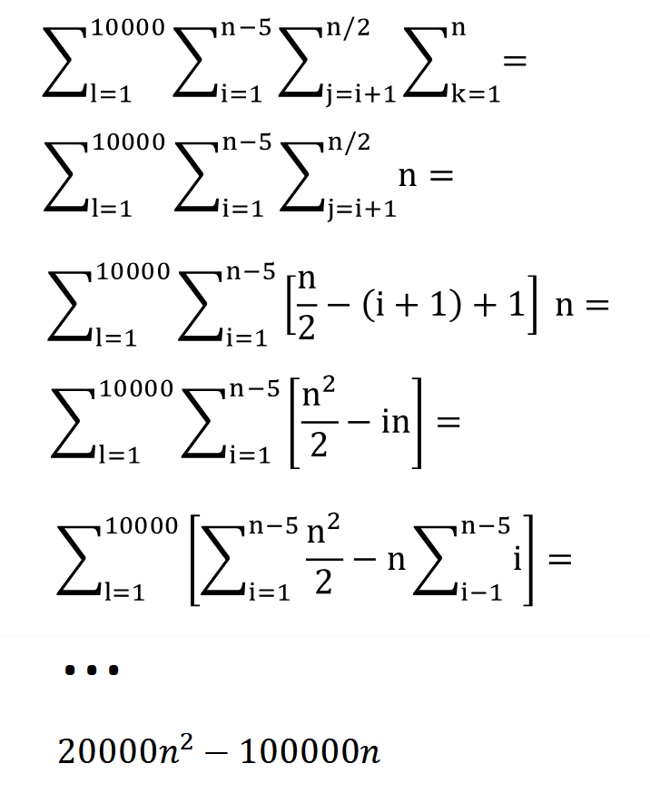
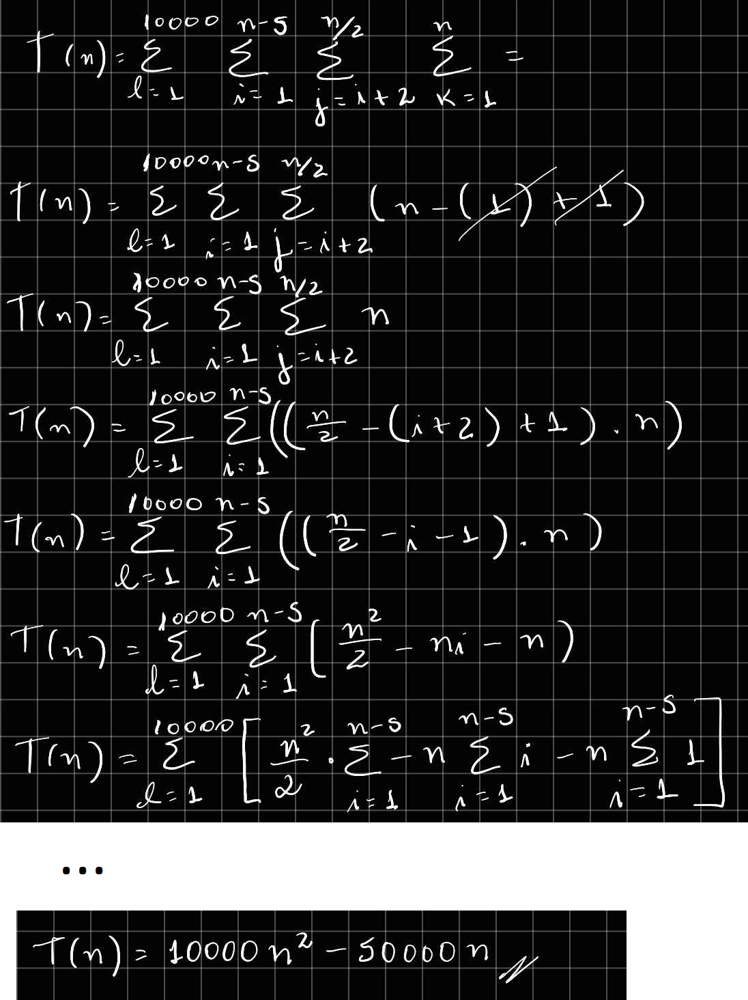
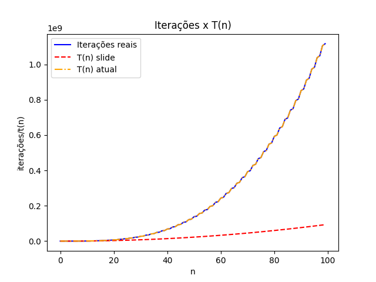
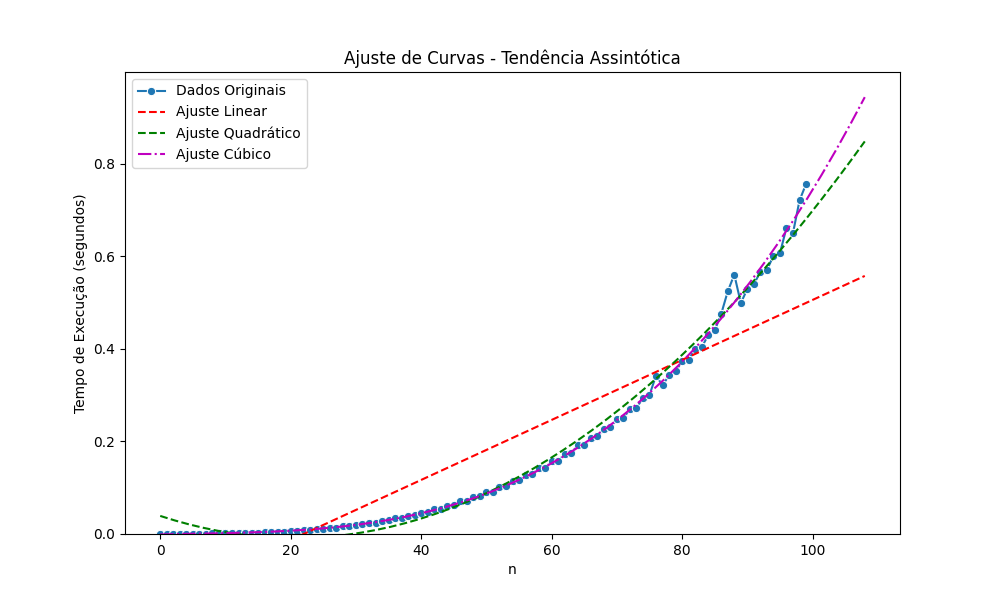
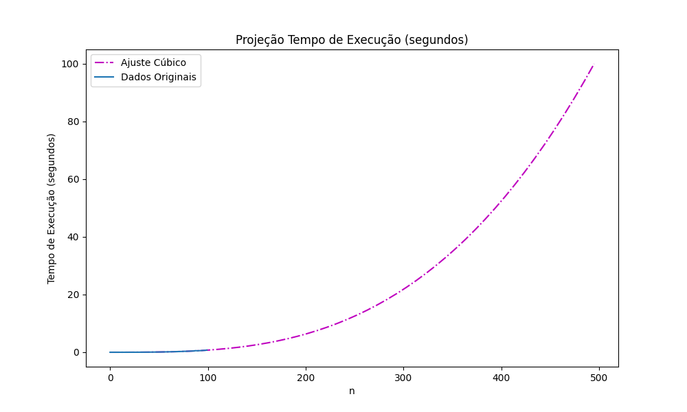

# GeorgeLucasZambonin_WandressaReis_ws_AA_RR_2024


## Analise

### Função de custo T(n)

#### Resolução:

##### Disponivel no slide


##### Resolução com passo a passo do slide


##### Função de custo correta
$$
T(n)=
\begin{cases}
1000  n  \dfrac{(\lfloor\dfrac{n}{2}\rfloor-2)\times(\lfloor\dfrac{n}{2}\rfloor-1)}{2} & \quad \text{se $n > 0$}\\ 
0 & \quad \text{se n = 0}
\end{cases}
$$
#### Comparação T(n)


### Complexidade



### Projeção assintotica $O(n^3)$



## Requirements

- GIT
- Python > 3.10

## Usage

### linux

#### Run on terminal:
```bash
git clone https://github.com/wandressareis/GeorgeLucasZambonin_WandressaReis_ws_AA_RR_2024
cd GeorgeLucasZambonin_WandressaReis_ws_AA_RR_2024
python3 -m venv .venv
source .venv/bin/activate
pip install -r requirements.txt
python3 ./app.py
```