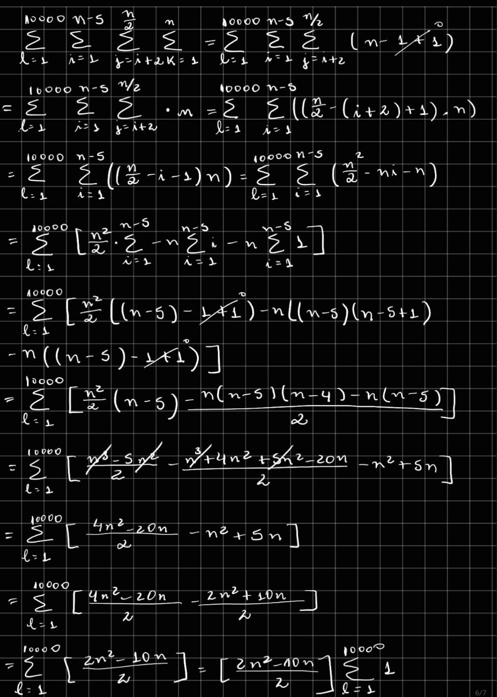
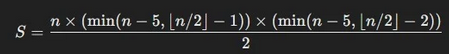

## Análise do Algoritmo "VerificaAlgo"

### Função de custo T(n)

#### Resolução:

#### Disponível no slide


##### Resolução com passo a passo do slide



#### Função de custo correta


#### Comparação T(n)
#### T(n) slide:
$$
T(n) = 10000n^2 - 50000n
$$

#### T(n) atual:

$$
T(n) = \frac{n \cdot \left( \min\left(n - 5, \left\lfloor \frac{n}{2} \right\rfloor - 1\right)\right) \cdot \left( \min\left(n - 5, \left\lfloor \frac{n}{2} \right\rfloor - 2\right)\right)}{2}
$$


### Complexidade


### Projeção assintotica $O(n^3)$


## Requirements

- GIT
- Python > 3.10

## Usage

### linux

#### Run on terminal:
```bash
git clone https://github.com/wandressareis/GeorgeLucasZambonin_WandressaReis_ws_AA_RR_2024
cd GeorgeLucasZambonin_WandressaReis_ws_AA_RR_2024
python3 -m venv .venv
source .venv/bin/activate
pip install -r requirements.txt
python3 ./app.py
```