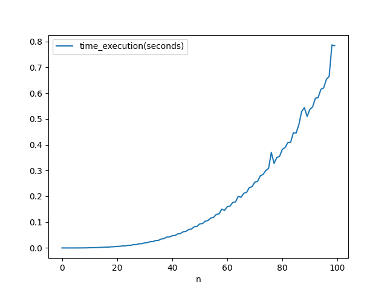
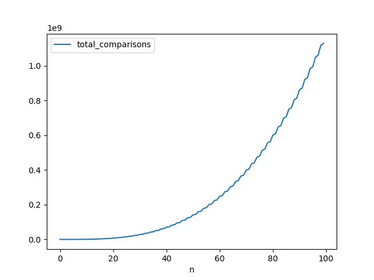

# GeorgeLucasZambonin_WandressaReis_ws_AA_RR_2024





## Requirements

- GIT
- Python > 3.10

## Usage

### linux

#### Run on terminal:
```bash
git clone https://github.com/wandressareis/GeorgeLucasZambonin_WandressaReis_ws_AA_RR_2024```
cd GeorgeLucasZambonin_WandressaReis_ws_AA_RR_2024
python3 -m venv .venv
source .venv/bin/activate
pip install -r requirements.txt
python3 ./app.py
```